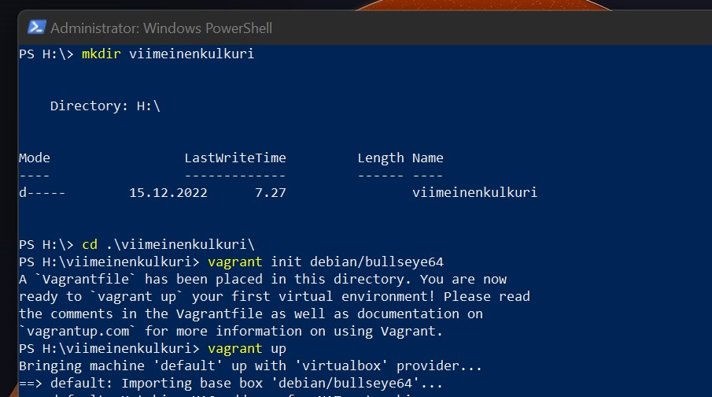
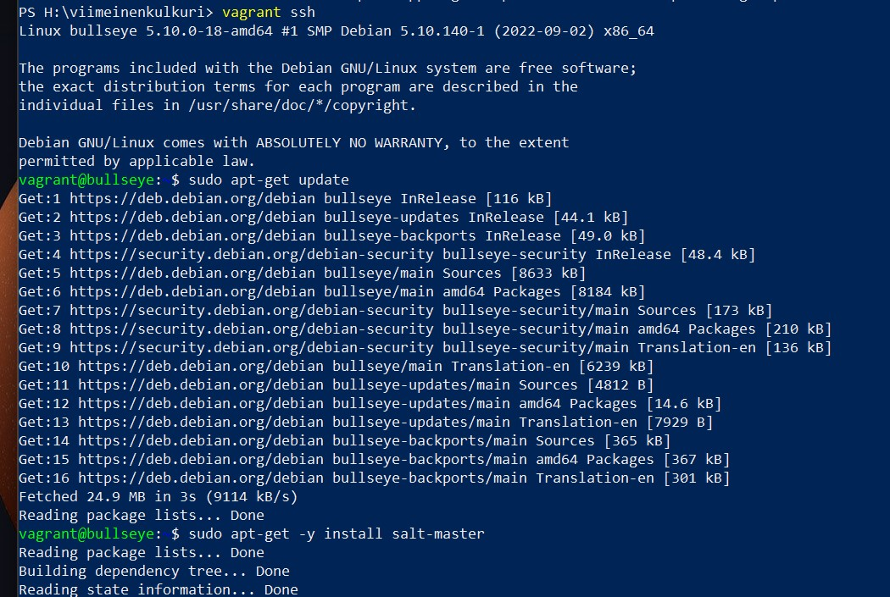
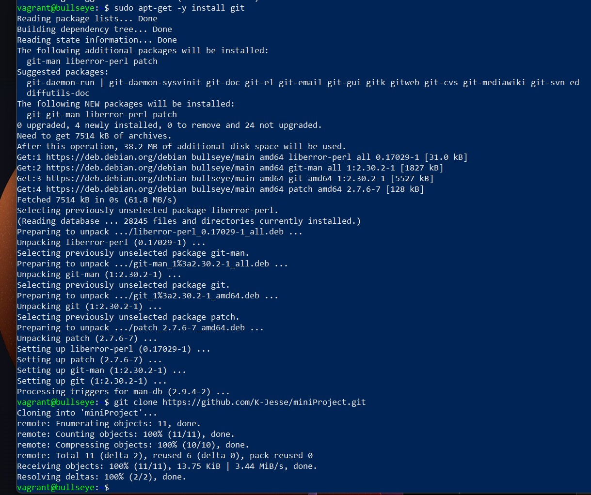
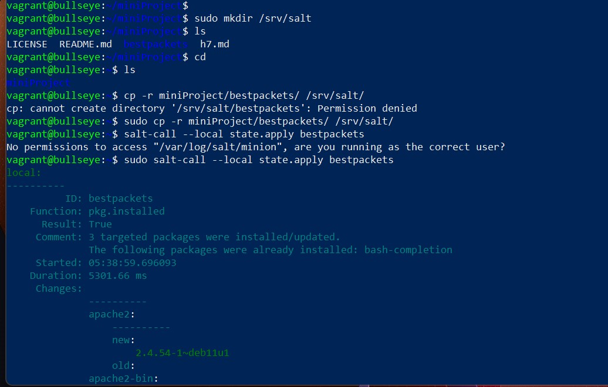
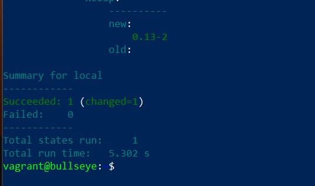

# My most used linux packets salt state

This is my small project for our [configuration management course](https://terokarvinen.com/2022/palvelinten-hallinta-2022p2/) by Tero Karvinen. In this project i will create a salt state that installs some packets that i have been used a lot on Teros courses. These packets are as follows:

- micro
- bash-completion
- apache2
- pyhton3-py

## Creating my salt state

So to begin i create the folder for the salt state.

	sudo mkdir /srv/salt/bestpackets
	
Inside here i create a `init.sls` file where i configure the packets i want the state to install when executed. 

	jessek@ruler:/srv/salt/bestpackets$ cat init.sls 
	bestpackets:
	  pkg.installed:
		- pkgs:
		  - micro
		  - bash-completion
		  - apache2
		  - python3-p

Finally lets try to run this state to see if it works.

	jessek@ruler:/srv/salt/bestpackets$ sudo salt-call --local state.apply bestpackets
	local:
	----------
			  ID: bestpackets
		Function: pkg.installed
		  Result: True
		 Comment: All specified packages are already installed
		 Started: 06:38:18.689613
		Duration: 41.297 ms
		 Changes:   

	Summary for local
	------------
	Succeeded: 1
	Failed:    0
	------------
	Total states run:     1
	Total run time:  41.297 ms

Seems to work fine. I already had all of these packets so it didn't install anything. This also means the state is idempotent.

To do one more final test lets create a new vagrant test environment and try to run the state there. First lets make a directory for vagrant and initialize it.

Next lets connect with ssh and install salt-master.

Also lets not forget git so we can clone the project.

Finally lets create a folder for the salt states and copy the salt state from the project inside it. Also lets run some final tests.

Everything seems to be in order! (After a few failed attempts)

## Sources

[Teros course material and lectures](https://terokarvinen.com/2022/palvelinten-hallinta-2022p2/)

[Vagrant Revisited – Install & Boot New Virtual Machine in 31 seconds](https://terokarvinen.com/2017/04/11/vagrant-revisited-install-boot-new-virtual-machine-in-31-seconds/)

[MarkDown Guide: Basic syntax](https://www.markdownguide.org/basic-syntax/)

